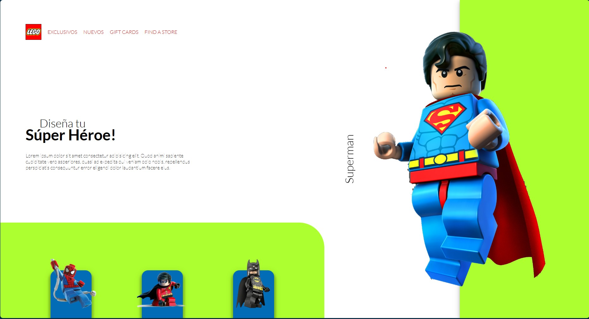

# lego-animaciones-css.github.io

---

# 🚀 Proyecto LEGO: Maquetación y Animaciones con CSS


Este proyecto es una práctica de **HTML, CSS y JavaScript** donde se desarrolla una landing page con:

- Animaciones al cargar elementos.
- Un **loader** inicial con círculos animados.
- Un **navbar animado**.
- Una sección principal con texto e imagen animada.
- Un **footer interactivo** con personajes de LEGO.
- Un **modal dinámico** con un **slider de cards** que cambia según el personaje seleccionado (Spiderman, Robin o Batman).

---

## ✨ Tecnologías utilizadas
- **HTML5** → Estructura de la página.  
- **CSS3 (Grid, Flexbox y Animaciones)** → Diseño y animaciones.  
- **JavaScript Vanilla** → Interactividad (abrir/cerrar modal, cambiar contenido del slider).  

---

## 📂 Estructura del proyecto

├── css/

│   └── style.css

├── img/

│   └── (imágenes de legos y superhéroes)

├── js/

│   └── app.js

├── index.html

└── README.md


---

## ¿Cómo funciona?

1. Al cargar la página, verás un loader animado.
2. En el footer, selecciona uno de los legos (Spiderman, Robin o Batman).
3. Se abrirá un modal con un slider de imágenes del personaje seleccionado.
4. Puedes cerrar el modal haciendo clic en el ícono de cerrar.

--

## 🖼️ Vista previa



---

## ⚡ Funcionalidades
- Loader animado al inicio.  
- Animaciones suaves de entrada en navbar, contenido principal y footer.  
- Modal con slider interactivo para cada personaje:  
  - Spiderman 🕷️  
  - Robin 🦸  
  - Batman 🦇  

---

## ▶️ Cómo usar
1. Clona el repositorio:
   ```bash
   git clone https://braynel87.github.io/lego-animaciones-css.github.io/

---

👨‍💻 Autor

Proyecto creado por BrayneL87 ✨
